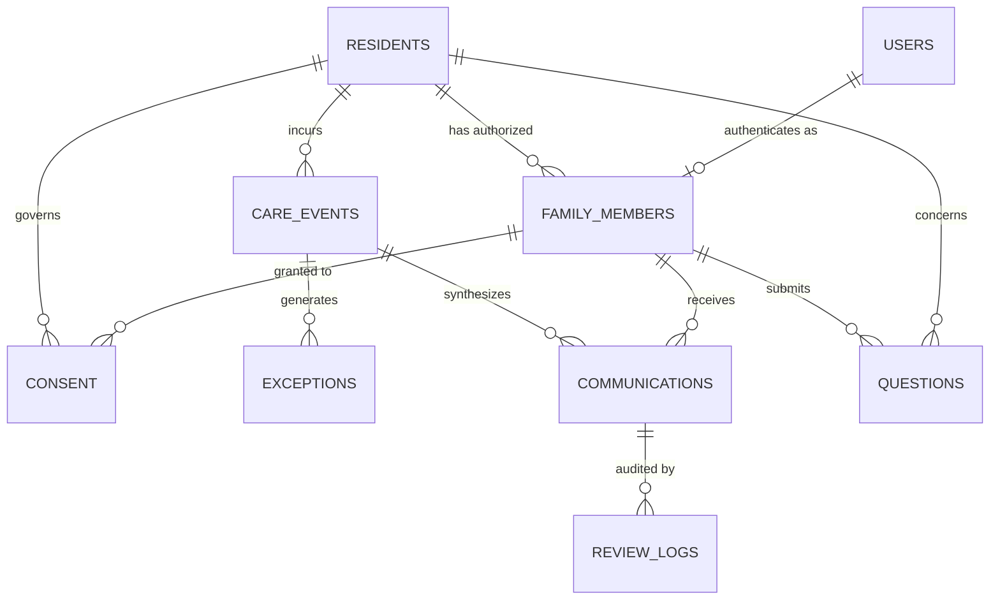

# System Architecture: Assisted-Living Operational Communication

## 1. Architectural Philosophy
The architecture is designed to be **simple, transparent, modular, and locally verifiable** for an academic proof-of-concept (Semester 5 C28). It avoids unnecessary microservices, external cloud dependencies, or unvetted commercial LLM APIs.

```
+-------------------------------------------------------------------------+
|                           PRESENTATION LAYER                            |
|  Jinja2 Templates (HTML5)  |  Responsive CSS (CSS3)  |  Vanilla JS (ES6) |
|  - Dashboard View          - Residents & Profiles    - Care Event Logger|
|  - Dual-Pane Comm View     - Human Review Queue      - Q&A Portal       |
+-------------------------------------------------------------------------+
                                    |
                                    v
+-------------------------------------------------------------------------+
|                          FLASK CONTROLLER (app.py)                      |
|  Session Auth  |  Role Switcher  |  REST API Routes  |  Audit Logging   |
+-------------------------------------------------------------------------+
                                    |
                                    v
+-------------------------------------------------------------------------+
|                             SERVICE LAYER                               |
|  - role_checker.py         : Enforces role-based access control         |
|  - consent_checker.py      : Enforces fine-grained resident consent     |
|  - safety_checker.py       : Intercepts medical jargon & flags review   |
|  - summary_generator.py    : Rule-based concise operational summarizer  |
|  - communication_service.py: Pipeline orchestrator & ledger manager     |
+-------------------------------------------------------------------------+
                                    |
                                    v
+-------------------------------------------------------------------------+
|                           DATA PERSISTENCE LAYER                        |
|  SQLite 3 (database.db) with Foreign Key Integrity & PRAGMA Checks       |
|  - users                   - care_events             - communications   |
|  - residents               - exceptions              - review_logs      |
|  - family_members          - consent                 - questions        |
+-------------------------------------------------------------------------+
```

## 2. Entity-Relationship Data Model
The relational SQLite database maintains referential integrity through foreign keys:



### Table Definitions:
1. `residents`: Core demographic and independence tier classifications.
2. `family_members`: Registered contacts, familial relationships, and designated operational roles.
3. `consent`: Resident-directed granular authorization matrix across 4 communication categories.
4. `care_events`: Normalized operational observations, assistance levels, urgencies, and internal notes.
5. `exceptions`: Operational deviations, severity tags, and resolution states.
6. `communications`: Generated operational summaries, disclosure statuses, review statuses, and block reasons.
7. `questions`: Family inquiries, categorization, and staff operational responses.
8. `review_logs`: Immutable audit trail of human supervisor actions (Approve, Edit, Reject, Escalate).
9. `users`: Credentials, password hashes (Werkzeug SHA-256), and linked role permissions.

## 3. Security, Privacy & Boundary Guarantees
- **No Plaintext Passwords:** Passwords hashed with `generate_password_hash` using salted SHA-256.
- **Strict Data Segregation:** `staff_note` is never stored in `communications.generated_summary`. Staff UI renders it inside a purple badge box strictly marked `Internal Staff Record`.
- **Pre-Disclosure Verification:** Verification takes place before summary synthesis. Unauthorized requests exit early and record a blocked ledger entry.
- **Fail-Safe Defaults:** If a consent record or role definition is missing or corrupt, access is denied by default.
