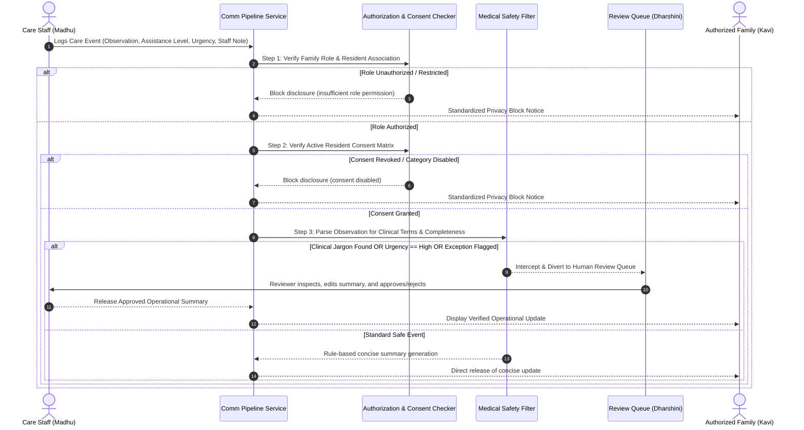

# Field Workflow: Operational Family Communication in Assisted Living

## 1. Problem Statement & Real-World Context
In modern assisted-living facilities, residents with varying independence levels (from Independent to Needs High Assistance) participate in daily routines, meals, social activities, and personal care. Assisted-living staff record observable operational notes during their shifts. 

However, communicating these updates to families presents an operational dilemma:
- **Under-Communication:** Families receive scarce updates, fostering anxiety and prompting repetitive calls to facility staff.
- **Over-Communication & Raw Log Leakage:** When raw care logs are shared directly, family members encounter internal shift handover jargon, unvetted staff observations, or accidental clinical notes. This induces unwarranted panic and violates resident privacy boundaries.

## 2. Operational vs. Medical Scope Boundary
The workflow operates strictly under an **operational non-medical boundary**:
- **Permitted Scope:** Observable daily events (meal attendance, activity participation, hygiene support, mobility walks, operational timing, and administrative appointments).
- **Prohibited Scope:** Medical diagnoses, clinical predictions, vital sign analyses, medication or dosage recommendations, and diagnostic conclusions.

```
+-----------------------------------------------------------------------------+
| SYSTEM BOUNDARY: OPERATIONAL SUPPORT ONLY                                  |
| "This system communicates care activities and operational observations.     |
|  It does not provide medical diagnosis, treatment recommendations, or      |
|  medical advice."                                                           |
+-----------------------------------------------------------------------------+
```

## 3. End-to-End Operational Workflow Steps



### Detailed Stage Breakdown:

1. **Care Event Ingestion:**
   Care staff record an observable event, selecting the category (e.g. Morning Routine, Meal, Social Activity), observed assistance level (Independent, Minimal, Moderate, High), urgency (Low, Normal, High), and optional internal staff notes.

2. **Segregation of Internal Data:**
   Internal shift notes and administrative handover flags are strictly segregated at the data layer. They are stored for staff continuity but are programmatically decoupled from family summaries.

3. **Role Authorization Check (`role_checker.py`):**
   The requesting contact's role is checked. Primary contacts have full operational scope; Secondary contacts receive routine/activity summaries; Emergency contacts receive only exception updates; View-Only contacts have sensitive logs blocked.

4. **Consent Matrix Verification (`consent_checker.py`):**
   Active resident consent is verified for the specific category of the event. If consent is revoked or the category is disabled, information is withheld.

5. **Rule-Based Operational Summarization (`summary_generator.py`):**
   The system synthesizes a concise, family-centered 1-2 sentence update emphasizing independence and participation without relying on unpredictable external LLMs.

6. **Safety & Boundary Classification (`safety_checker.py`):**
   The observation and generated text are scanned against a clinical vocabulary index. Any detection of medical diagnoses, symptoms, or medications triggers human review.

7. **Human Review Gate (`review_queue.py`):**
   Supervisory staff inspect gated events, refine wording if needed, and officially record an audit decision (Approve, Edit, Reject, Escalate).

8. **Family Portal Delivery:**
   Only verified, authorized, and non-medical summaries are exposed on the family member's portal.
